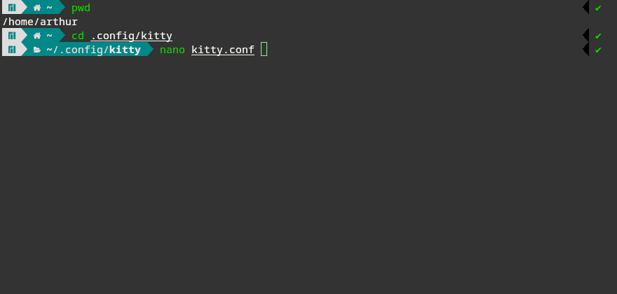
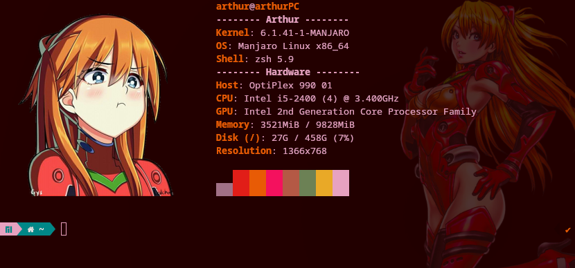

<h1 align="center">Configuración de terminal kitty </h1>
<p align="center">Se mostrará cómo instalar y configurar la terminal kitty.</p>

<h2 align="center">1. Instalación :inbox_tray:</h2>
<p align="justify">Para la instalción de la terminal Kitty hay que tener presente qué distribución de Linux estamos usando, usremos los siguientes comandos en nuestra terminal:</p>

### Debian (Ubuntu, Mint)
```bash
sudo apt install kitty
```
### Arch (Manjaro)
```bash
sudo pacman -S kitty
```

<br>
<h2 align="center">2. Configuración :wrench:</h2>
<p align="justify">Se tiene que mencionar que esta terminal al momento de ser instalada, no viene con algún archivo de configuración por lo que tiene que ser creado. Así mismo estarán disponibles los comandos que se irán utilizando.</p>

### 2.1 Cración del archivo de configuración :page_facing_up:
<p align="justify">Para crear este archivo nos moveremos a la carpeta que se crea cuando se instala kitty, crearemos el archivo con "touch" con el nombre "kitty.conf" y listaremos para verificar que se nos haya creado este archivo de ocnfiguración. Todo esto con la siguietne línea.</p>

```bash
cd ~/.config/kitty; touch kitty.conf; ls
```
<div align="center">
    
</div>

<br>

### 2.2 Editar el archivo "kitty.conf" :pencil:
<p>:pushpin: En este mismo repositorio está mi archivo de configuración como ejemplo.</p>
<p align="justify">Podemos usar cualquier editor de texto de nuestra preferencia para visualizar y editar el archivo con extensión '.conf' que acabamos de crear. Para esta guía se usará el editor nano.</p>


```bash
nano kitty.conf
```

### 2.2.1 Fuente de la letra
```conf
font_family terminus     # Familia de fuentes utilizada
italic_font auto         # Fuente italica
bold_italic_font auto    # Control de letra en negrita
font_size 11.0           # Tamaño de la letra
```

### 2.2.2 Tema (Colores)
```conf
foreground #f8f8f2      # Color del texto
background #000000      # Color de fondo
url_color #d65c9d       # Color de los enlaces o URLs
```

### 2.2.3  Cursor 
```conf
cursor #8fee96          # color del cursor
cursor_beam_thickness 1.5
```

### 2.2.4 Opacidad del fondo
```conf
term xterm-256color     # Pendiente por documentar...
background_opacity 0.8  # Opacidad del fondo. Valores entre 0 y 1.
```

### 2.2.5 Scrollback 
```conf
scrollback_lines 2000   # Cantidad de lineas que guarda
```

### 2.2.6 Medidas de la ventana de la terminal
```conf
remember_window_size  no
initial_window_width  880   # Ancho
initial_window_height 420   # Alto

window_border_width 0.5pt   # Sombreado exterior de la ventana
draw_minimal_borders yes    # Borde para separar con otras ventanas
```
<h2 align="center">3. Ejemplos propios</h2>
<p align="justify">Estos ejemplos son configuraciones propias, el detalle es que he incorporado herramientas extra. La finalidad de estos ejemplos es mostrar lo que se puede llegar a lograr con la temrinal kitty.</p>
<br>

### 3.1 Asuka Terminal (Zsh)
<div align="center">
    
</div>